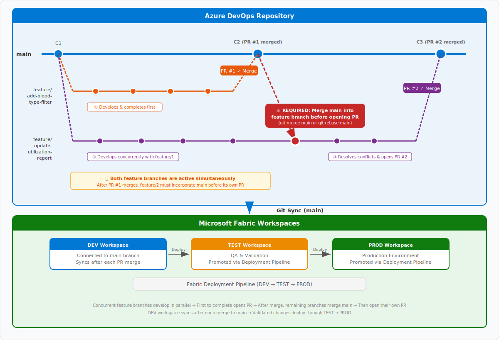
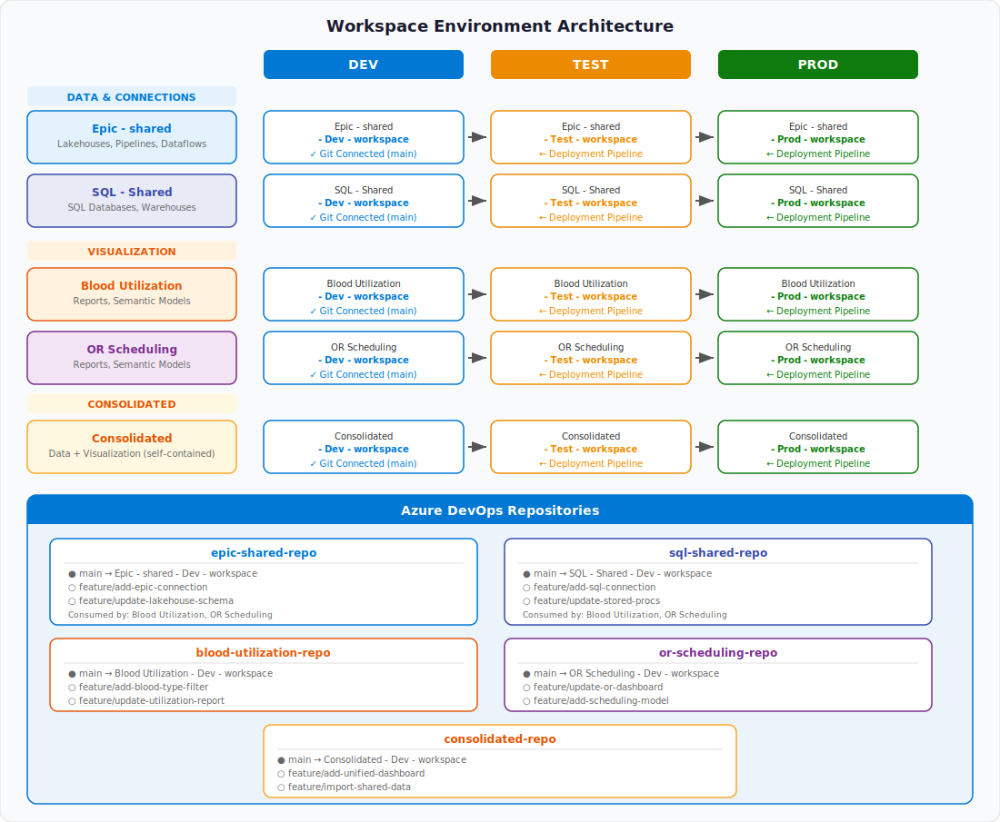
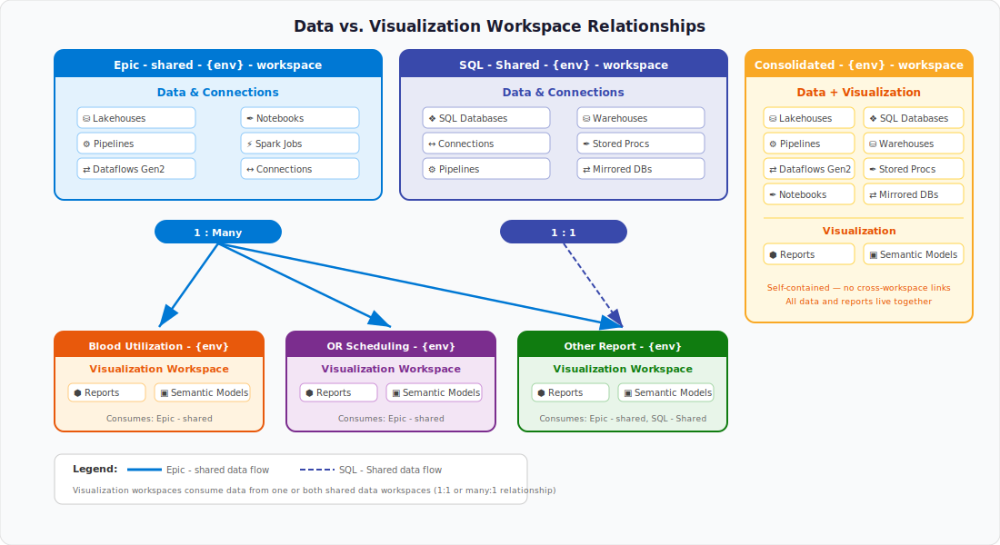
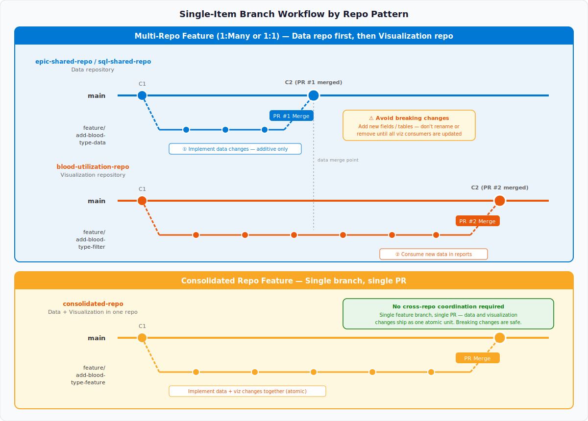

# Git Feature Branch Workflow Guide for Microsoft Fabric

**Integrating Azure DevOps CI/CD with Fabric Workspace Git Sync**

*May 2026*

## Overview

This repository is a practical, end-to-end guide for teams adopting a Git-based feature branch workflow with Microsoft Fabric and Azure DevOps. It explains core Git concepts, walks through the day-to-day developer workflow (feature branches, pull requests, code review, and merging to main), and then shows how those practices map onto Fabric's workspace Git integration and Deployment Pipelines for promoting changes through Dev, Test, and Prod.

It is intended for data engineers, analytics engineers, BI developers, and platform owners who need a shared reference for how source control, CI/CD, and Fabric workspace management fit together — covering repository and workspace architecture, supported Fabric item types, role and permission requirements, network and authentication considerations, and recommended patterns for coordinating changes across shared data workspaces and downstream visualization workspaces.

---

# PART 1: GIT FUNDAMENTALS

## Section 1: Introduction to Git and Version Control

### 1.1 What is Git?

Git is a distributed version control system that tracks changes to files and coordinates work among multiple people. It allows developers and data professionals to:

- Track every change made to project files with a complete history
- Revert to any previous version if something goes wrong
- Work on multiple features or fixes simultaneously without interference
- Collaborate across teams with structured review processes

### 1.2 Key Git Concepts

- **Repository (repo):** A storage location for your project files and their complete change history. Think of it as a project folder tracked by Git.
- **Branch:** An independent line of development. Branches allow you to work on changes without affecting the main codebase.
- **Commit:** A snapshot of your changes at a point in time, with a message describing what changed and why.
- **Merge:** The process of combining changes from one branch into another.
- **Pull Request (PR):** A formal request to merge changes from one branch to another, typically including a code review step. In Azure DevOps, this is where peers review and approve changes before they are integrated.
- **Clone:** Creating a local copy of a remote repository on your computer.
- **Push:** Sending your local commits to the remote repository.
- **Pull/Fetch:** Downloading changes from the remote repository to your local copy.
- **Conflict:** When two branches have made different changes to the same part of a file. Conflicts must be resolved manually before merging.

## Section 2: The Feature Branch Workflow

### 2.1 What is a Feature Branch Workflow?

The feature branch workflow is a Git branching model where all feature development takes place in dedicated branches instead of the main branch. This encapsulation makes it easy for multiple developers to work on particular features without disturbing the main codebase. It also means the main branch always contains production-ready, stable code.

Key principles:

- The **main** branch always contains production-ready, stable code
- All new work is done on dedicated **feature branches** created from main
- Feature branches follow the naming convention: **feature/{feature-name}** (e.g., feature/add-patient-demographics, feature/update-blood-utilization-report)
- Changes are integrated back into main via **pull requests (PRs)** in Azure DevOps
- Code reviews are mandatory before merging to ensure quality

### 2.2 Feature Branch Workflow Diagram

<!-- IMAGE PLACEHOLDER 1: Feature Branch Workflow Diagram -->


*Developers create feature branches from main and work concurrently. The first branch to complete opens a Pull Request and merges to main. Remaining active branches must merge the updated main into their branch (`git merge main` or `git rebase main`) before opening their own Pull Request. This ensures each PR is based on the latest code and conflicts are resolved before review. Once merged, the Dev workspace syncs and changes flow through Deployment Pipelines to Test and Prod.*

### 2.3 Working with Concurrent Feature Branches

When multiple feature branches are active simultaneously, it is critical that after any feature branch merges to main via a pull request, all other in-progress feature branches merge the updated main branch into their own branch before opening their pull request. This can be done via `git merge main` or `git rebase main` from the feature branch.

This practice ensures that:

- Merge conflicts are resolved locally by the developer, not during the PR review
- The pull request diff is accurate and reflects only the feature's changes
- CI/CD validation runs against the true combined state of the code

## Section 3: Day-to-Day Git Workflow - Detailed Steps

### 3.1 Starting New Work (Creating a Feature Branch)

1. **Identify the work item** - In Azure DevOps, create or find the work item (User Story, Task, Bug) for the change.
2. **Create a feature branch from main** - In Azure DevOps Repos or via Git CLI:
   - Navigate to Repos → Branches → Click "New Branch"
   - Name: feature/{descriptive-name} (e.g., feature/add-blood-type-filter)
   - Based on: main
   - Click Create

Or via CLI:

```bash
git checkout main
git pull origin main
git checkout -b feature/add-blood-type-filter
```

3. **Develop your changes** - Make changes using your preferred tools (locally or in the Fabric UI for Fabric-native items).

### 3.2 Committing Changes

**From the command line:**

```bash
git add .
git commit -m "feat: add blood type filter to utilization report"
git push origin feature/add-blood-type-filter
```

Best practices for commit messages:

- Use a short, descriptive summary (50 characters or less for the subject line)
- Use imperative mood ("add filter" not "added filter")
- Reference work item numbers when applicable

### 3.3 Creating a Pull Request in Azure DevOps

1. Navigate to Azure DevOps → Repos → Pull Requests
2. Click **New Pull Request**
3. Set source branch: feature/add-blood-type-filter
4. Set target branch: main
5. Add a descriptive title and description linking the related work item
6. Add required reviewers
7. Click **Create**

**Pull Request Policies (recommended):**

| Policy | Setting | Purpose |
|---|---|---|
| Minimum reviewers | 1 (or more) | Ensure peer review of all changes |
| Check for linked work items | Required | Traceability to requirements |
| Check for comment resolution | Required | All feedback is addressed |
| Limit merge types | Squash merge only | Keep main branch history clean |
| Build validation | Optional | Run automated checks on PRs |
| Require up-to-date branches | Recommended | Ensures feature branches have merged the latest main before PR can complete |

### 3.4 Code Review and Approval

1. Reviewers examine the changes in the Azure DevOps PR Files tab
2. Reviewers leave comments, request changes, or approve
3. Once approved and all policies are satisfied, the PR can be completed

### 3.5 Merging to Main

1. Complete the Pull Request using the preferred merge strategy:
   - **Squash merge** (recommended): Combines all feature branch commits into a single clean commit on main
   - **Merge commit**: Preserves full branch history
2. Optionally delete the feature branch after merge
3. The main branch now contains the approved changes

### 3.6 Updating Other In-Progress Feature Branches

After a pull request is merged to main, any other feature branches still in development must incorporate the latest changes from main before they can open their own pull request:

1. Switch to your feature branch:

```bash
git checkout feature/update-utilization-report
```

2. Pull the latest main:

```bash
git fetch origin
git merge origin/main
```

Or use rebase:

```bash
git rebase origin/main
```

3. Resolve any merge conflicts locally
4. Push the updated branch:

```bash
git push origin feature/update-utilization-report
```

5. Now create your Pull Request - reviewers will see a clean diff that only includes your feature changes

**Why this matters:** Without merging main first, your PR may show stale diffs, introduce merge conflicts during review, or cause unexpected failures when merged. This step is a mandatory part of the workflow when multiple developers are working concurrently.

## Section 4: Azure DevOps CI/CD Integration

### 4.1 Repository Setup

1. Create a new project in Azure DevOps (e.g., "Fabric Analytics")
2. Under Repos, create repositories for each workspace group
3. Initialize with a main branch
4. Configure branch policies on main (see Section 3.3 table)

### 4.2 Automated Pipelines (Optional Advanced)

For teams ready to automate further, Azure DevOps Pipelines can:

- **Trigger on PR creation**: Run Best Practice Analyzer rules, linting, or validation
- **Trigger on merge to main**: Call Fabric REST APIs to publish environments or trigger deployment pipelines
- **Use the fabric-cicd Python library**: Microsoft's open-source tool for deploying Fabric items programmatically

Example YAML pipeline trigger:

```yaml
trigger:
  branches:
    include:
      - main

pool:
  vmImage: 'ubuntu-latest'

steps:
  - task: UsePythonVersion@0
    inputs:
      versionSpec: '3.10'

  - script: |
      pip install fabric-cicd
      python deploy_script.py
    displayName: 'Deploy Fabric Items'
```

---

# PART 2: MICROSOFT FABRIC AND GIT INTEGRATION

## Section 5: Introduction to Fabric Git Integration

### 5.1 What is Fabric Git Integration?

Microsoft Fabric's Git integration enables developers to integrate their development processes, tools, and best practices directly into the Fabric platform. It connects a Fabric workspace to a Git repository (Azure DevOps or GitHub), allowing teams to:

- Backup and version their Fabric items (reports, notebooks, pipelines, etc.)
- Revert to previous stages as needed
- Collaborate with others or work alone using Git branches
- Apply familiar source control tools to manage Fabric items

The integration operates at the workspace level - developers version items within a workspace in a single process, with full visibility to all their items. The workspace folder structure (including subfolders) is preserved in the Git repository.

### 5.2 Supported Git Providers

- Azure DevOps (cloud-based only)
- GitHub (cloud-based only)
- GitHub Enterprise (cloud-based only)

### 5.3 Prerequisites

**Fabric Prerequisites:**

- Access to a Fabric capacity (or Power BI Premium capacity for Power BI items)
- Tenant admin settings enabled:
  - "Users can create Fabric items"
  - "Users can synchronize workspace items with their Git repositories"
  - "Create workspaces" (for branching out)

**Azure DevOps Prerequisites:**

- Active Azure DevOps account registered to the same user as the Fabric workspace
- Access to an existing repository

## Section 6: Fabric Git Integration - Supported Items and Status

### 6.1 Overview

Fabric's Git integration supports a growing list of items across different workload domains. Some items are generally available (GA) and others are in Preview. Items marked as "Preview" may have limited functionality and are subject to change.

**Unsupported items** in a workspace or Git directory are simply ignored during synchronization - they are not saved or synced but remain visible in the workspace.

### 6.2 Supported Items by Domain

| Domain | Item | Status |
|---|---|---|
| Data Engineering | Environment | **GA** |
| Data Engineering | GraphQL | **GA** |
| Data Engineering | Lakehouse | **GA** |
| Data Engineering | Notebooks | **GA** |
| Data Engineering | Spark Job Definitions | **GA** |
| Data Engineering | User Data Functions | **GA** |
| Data Science | Machine Learning Experiments | *Preview* |
| Data Science | Machine Learning Models | *Preview* |
| Data Science | Data Agents | *Preview* |
| Data Factory | Copy Job | **GA** |
| Data Factory | Dataflow Gen2 | **GA** |
| Data Factory | Pipeline | **GA** |
| Data Factory | Mirrored Database | **GA** |
| Data Factory | Mount ADF | **GA** |
| Data Factory | Mirrored Snowflake | *Preview* |
| Real-Time Intelligence | Activator | *Preview* |
| Real-Time Intelligence | Eventhouse | **GA** |
| Real-Time Intelligence | EventStream | **GA** |
| Real-Time Intelligence | KQL Database | **GA** |
| Real-Time Intelligence | KQL Queryset | **GA** |
| Real-Time Intelligence | Real-Time Dashboard | **GA** |
| Real-Time Intelligence | Event Schema Set | *Preview* |
| Real-Time Intelligence | Maps | *Preview* |
| Real-Time Intelligence | Anomaly Detection | *Preview* |
| Data Warehouse | Warehouse | *Preview* |
| Data Warehouse | Mirrored Azure Databricks Catalog | **GA** |
| Power BI | Metrics Set | *Preview* |
| Power BI | Org App | *Preview* |
| Power BI | Paginated Report | *Preview* |
| Power BI | Report | *Preview* |
| Power BI | Semantic Model | *Preview* |
| Database | SQL Database | **GA** |
| Database | Cosmos Database | *Preview* |
| Graph | Graph in Microsoft Fabric | *Preview* |
| Industry Solutions | Healthcare | *Preview* |
| Industry Solutions | Healthcare Cohort | *Preview* |

**Notes on Power BI items:**

- Reports connected to semantic models hosted in Azure Analysis Services, SQL Server Analysis Services, or MyWorkspace are excluded
- Semantic Models: Push datasets, live connections to Analysis Services, and model v1 are excluded

### 6.3 Where to Check Current Support and Preview Status

> The official and most up-to-date list of supported items is maintained at:
>
> **Microsoft Learn — [Overview of Fabric Git Integration](https://learn.microsoft.com/en-us/fabric/cicd/git-integration/intro-to-git-integration)**
>
> Additional resources:
>
> - [Fabric CI/CD Overview](https://learn.microsoft.com/en-us/fabric/cicd/cicd-overview)
> - [Git Integration Getting Started](https://learn.microsoft.com/en-us/fabric/cicd/git-integration/git-get-started)
> - [Fabric Deployment Pipelines](https://learn.microsoft.com/en-us/fabric/cicd/deployment-pipelines/intro-to-deployment-pipelines)

## Section 7: Workspace Architecture for Fabric

### 7.1 Workspace Naming Convention and Environment Strategy

Each named workspace follows a Dev → Test → Prod promotion pattern:

**{Workspace Name} - {Environment} - workspace**

Environments:

- **Dev** - Active development; connected to the main branch via Git integration
- **Test** - QA and validation; receives promotions from Dev via Fabric Deployment Pipelines
- **Prod** - Production; receives promotions from Test via Fabric Deployment Pipelines

### 7.2 Example Workspace Mapping

| Workspace Name | Purpose | Dev Workspace | Test Workspace | Prod Workspace |
|---|---|---|---|---|
| Epic - shared | Shared data platform - Lakehouses, Pipelines, Dataflows, Notebooks | Epic - shared - Dev - workspace | Epic - shared - Test - workspace | Epic - shared - Prod - workspace |
| SQL - Shared | Shared SQL databases, connections, stored procedures, and warehouses | SQL - Shared - Dev - workspace | SQL - Shared - Test - workspace | SQL - Shared - Prod - workspace |
| Blood Utilization | Visualization and reporting for Blood Utilization | Blood Utilization - Dev - workspace | Blood Utilization - Test - workspace | Blood Utilization - Prod - workspace |
| OR Scheduling | Visualization and reporting for OR Scheduling | OR Scheduling - Dev - workspace | OR Scheduling - Test - workspace | OR Scheduling - Prod - workspace |



*Figure 2: Workspace Environment Architecture and Repository Strategy*

### 7.3 Data vs. Visualization Workspace Relationship

In this architecture, workspaces serve different purposes:

- **Data / Data Connection Workspaces** (e.g., "Epic - shared", "SQL - Shared"): Contain shared data assets such as Lakehouses, Pipelines, Dataflows, Notebooks, SQL Databases, Warehouses, and data connections. These are typically shared across multiple visualization workspaces in a 1:many relationship. In this architecture there are two shared data workspaces - "Epic - shared" for EHR data and lakehouse assets, and "SQL - Shared" for SQL database connections and warehouses.

- **Visualization Workspaces** (e.g., "Blood Utilization", "OR Scheduling"): Contain Power BI reports, semantic models, and dashboards that consume data from one or both shared data workspaces. These may have a 1:1 or many:1 relationship with data workspaces depending on scope. For example, Blood Utilization may consume data from both Epic - shared and SQL - Shared, creating a many-to-one data consumption pattern.

<!-- IMAGE PLACEHOLDER 3: Data vs. Visualization Workspace Relationships -->


*Figure 3: Data vs. Visualization Workspace Relationships*

### 7.4 Repository Strategy

| Repository Name | Connected Workspace | Branch Strategy |
|---|---|---|
| epic-shared-repo | Epic - shared - Dev - workspace | main (Dev sync), feature/* branches for development |
| sql-shared-repo | SQL - Shared - Dev - workspace | main (Dev sync), feature/* branches for development |
| blood-utilization-repo | Blood Utilization - Dev - workspace | main (Dev sync), feature/* branches for development |
| or-scheduling-repo | OR Scheduling - Dev - workspace | main (Dev sync), feature/* branches for development |

**Note:** Only the Dev environment workspace is connected to Git. Test and Prod are promoted via Fabric Deployment Pipelines.

### 7.5 Coordinating a Single Feature Across Data and Visualization Repositories

Some features require coordinated changes across both a shared data repository and a downstream visualization repository. In these cases, treat the work as a single feature with parallel feature branches created at the same time in both repos, using the same branch name and linked work item where possible. This keeps the scope aligned and makes it easier to trace the end-to-end change from data model updates through report or semantic model updates.

The critical rule is that the data repository must be committed, reviewed, and merged before the visualization repository is merged. Because visualization assets often depend on the data contract exposed by shared tables, views, semantic models, or pipelines, the data change must be introduced first in a way that does not break existing consumers. Backward compatibility is essential: additive changes such as new columns, new measures, or new views are preferred, while renames, deletions, or incompatible schema changes should be avoided until all dependent visualization changes have been deployed and validated.

1. **Create matching feature branches in both repos** - Cut the feature branch from main in the data repo and the visualization repo at the same time, using a shared naming convention such as **feature/{feature-name}**.
2. **Implement the data change first** - Build and validate the data changes so they introduce the new capability without breaking existing reports, models, or downstream dependencies.
3. **Open and merge the data PR first** - Complete code review and merge the data feature branch into main before attempting to merge the visualization branch.
4. **Update the visualization branch from main** - After the data PR merges, pull or merge the latest main into the visualization feature branch so it is tested against the newly merged data state.
5. **Complete visualization changes against the new data contract** - Update reports, semantic models, dashboards, or other visual assets to use the new fields or structures introduced by the data change.
6. **Validate end-to-end behavior before merging visualization** - Confirm that existing consumers still work, that the new visualization feature behaves correctly, and that no backward compatibility issues were introduced during the transition period.
7. **Merge the visualization PR last** - Once validated, merge the visualization branch into main and promote environments in dependency order, ensuring shared data assets are deployed before dependent visualization assets.

<!-- IMAGE PLACEHOLDER 4: Branch Workflow by Repository Pattern -->


*Figure 4: Branch Workflow by Repository Pattern*

## Section 8: Git Operations in Microsoft Fabric

### 8.1 Connecting a Workspace to Azure DevOps

1. Sign in to Microsoft Fabric and navigate to the Dev workspace
2. Go to **Workspace Settings** → **Git Integration**
3. Select **Azure DevOps** as the Git provider
4. Authenticate (OAuth2 or Service Principal)
5. Select: Organization, Project, Repository, Branch (main), Folder (optional)
6. Click **Connect and Sync**
7. On first sync, if one side is empty, content copies from the non-empty side. If both have content, choose sync direction.

#### 8.1.1 Required Workspace Roles for Git Operations

Fabric Git operations require specific workspace roles. Plan permissions so that the right people can perform each operation without granting broader access than necessary. The following table summarizes the minimum role required for each Git-related action in a Fabric workspace:

| Git Action | Minimum Workspace Role |
|---|---|
| Connect or disconnect workspace from Git | Admin |
| Switch branches or create a new branch in the workspace | Admin |
| Commit changes to Git | Admin, Member, or Contributor (must have permission to edit affected items) |
| Update workspace from Git | Admin, Member, or Contributor |
| Branch out to a new workspace | Admin, Member, or Contributor (plus tenant permission to create workspaces) |
| View Git status and history in the workspace | Viewers do not see the Source Control panel; Contributor or above is required |

**Tip:** Reserve the Admin role for a small group responsible for Git connection lifecycle (connect, disconnect, switch branch), and grant Contributor or Member to day-to-day developers who only need to commit and update.

### 8.2 Committing Changes from Fabric

1. Make changes to Fabric items (notebooks, pipelines, reports, etc.) within the workspace
2. Click the **Source Control** icon in the workspace toolbar
3. The panel shows all items with uncommitted changes
4. Select items to include in this commit
5. Write a descriptive commit message
6. Click **Commit** to push changes to the connected Git branch
7. Item status updates from "Uncommitted" to "Synced"

### 8.3 Updating Workspace from Git

When other team members merge changes to the connected branch:

1. A notification badge appears on the Source Control icon
2. Open the Source Control panel and navigate to the **Updates** tab
3. Review the list of incoming changes
4. Click **Update All** to apply changes from Git to the workspace
5. After update, status shows "Synced"

**Important:** Some items (like Environments) may require a Publish action after syncing from Git to ensure runtime settings take effect.

### 8.4 Branching Out from Fabric (Branched Workspaces)

Fabric supports creating a new workspace connected to a different branch - ideal for feature development:

1. In the Source Control panel, select **Branch out**
2. Choose an existing feature branch or create a new one
3. Use **Selective Branching** to include only the items you need (instead of the entire workspace)
4. A new workspace is created connected to the selected branch
5. A formal relationship between source and branched workspace is maintained in the Fabric UI

**Recommended pattern for concurrent development:** When multiple developers are working on the same workspace simultaneously, each developer should use their own branched workspace rather than editing the shared Dev workspace directly. The Fabric workspace is a shared runtime, so direct changes by one developer can override or interfere with another developer's in-progress work. Branching out gives each developer an isolated workspace tied to their feature branch, which they can develop and test independently before merging back to main and syncing to the shared Dev workspace.

### 8.5 Comparing Code Changes

Before committing or updating, use the **Compare Code Changes** feature (Preview):

1. In the Source Control panel, select an item with changes
2. Click to view the diff - side-by-side comparison of current workspace state vs. Git branch state
3. Review what changed before committing or accepting updates

### 8.6 Conflict Resolution

If the workspace and Git branch both have changes to the same item:

1. Fabric flags a conflict in the Source Control panel
2. You must choose which version to keep (workspace or Git)
3. Best practice: Always update from Git before making new changes to minimize conflicts

### 8.7 Disconnecting from Git

If needed, a workspace admin can disconnect:

1. Go to **Workspace Settings** → **Git Integration**
2. Click **Disconnect**
3. Items remain in the workspace but are no longer synced

### 8.8 Network Security and Authentication Considerations

Before connecting a Fabric workspace to Azure DevOps, review the following platform-level requirements. These are documented constraints in Fabric's Git integration and, if overlooked, can cause sync failures or block the connection from succeeding:

- **Authentication strength parity:** The authentication method used to sign in to Fabric must be at least as strong as the method required by your Git provider. For example, if your Azure DevOps tenant requires multi-factor authentication (MFA), Fabric sign-in must also enforce MFA. A weaker Fabric sign-in will cause the Git connection to be rejected.
- **Cross-geo exports:** If the Fabric workspace and the Azure DevOps repository are hosted in different geographic regions, a tenant administrator must explicitly enable cross-geo exports for the connection to work. This applies whenever workspace capacity region and Azure DevOps organization region do not match.
- **IP Conditional Access policies:** If your tenant has an IP-based Conditional Access policy validated against the Fabric service, that policy will block Azure DevOps Git integration. The integration relies on service-to-service calls that do not originate from the user's IP. Exclude Fabric's Git integration scenarios from the policy or use an alternative control.
- **Sovereign clouds:** Git integration is not supported in sovereign (national) clouds such as Government, China, or other regionalized Microsoft cloud environments. Customers in these environments must rely on alternative approaches (such as fabric-cicd with REST APIs) for source control.
- **Git submodules:** Repositories that contain Git submodules are not supported. The repository connected to the Fabric workspace must be self-contained, with all required content tracked directly in the repository rather than through submodule references.

## Section 9: Promoting Changes - Fabric Deployment Pipelines

### 9.1 Dev → Test → Prod Promotion

1. Navigate to **Deployment Pipelines** in Fabric
2. Open the pipeline mapped to your workspace set
3. Review changes staged in Dev
4. Click **Deploy** to promote from Dev → Test
5. Validate and test in the Test workspace
6. Once validated, click **Deploy** to promote from Test → Prod

### 9.2 Deployment Considerations

- Configure **deployment rules** for data source parameter swaps between environments
- Use **Variable Libraries** (where supported) for environment-aware parameterization
- For items not supporting Variable Libraries, use parameter.yml via the fabric-cicd tool
- Deploy data workspaces (Epic - shared, SQL - Shared) BEFORE visualization workspaces that depend on them

---

# PART 3: BEST PRACTICES AND REFERENCE

## Section 10: Best Practices and Recommendations

### 10.1 Branching Best Practices

- Always create feature branches from main - never develop directly on main
- Use descriptive branch names: feature/{brief-description}
- Keep feature branches short-lived (merge within days, not weeks)
- Delete feature branches after they are merged
- Use branch policies to enforce PR-based merging
- When multiple feature branches are active, always merge main into your feature branch after any other PR merges to main
- Resolve conflicts on your feature branch locally - never leave conflict resolution for the PR reviewer

### 10.2 Workspace Management

- Only connect Dev workspaces to Git; Test and Prod are managed via Deployment Pipelines
- Use separate repositories per workspace group to avoid cross-team conflicts
- Keep workspace naming consistent: {Name} - {Environment} - workspace
- When multiple developers are editing items in the same workspace concurrently, give each developer their own branched workspace (via Branch out) so individual changes do not override one another in the shared Dev runtime
- Shared data workspaces (e.g., Epic - shared, SQL - Shared) may serve multiple visualization workspaces - coordinate changes carefully as they have downstream impact
- Consider the dependency order when deploying - data workspaces should be deployed before visualization workspaces that consume them

### 10.3 Collaboration Tips

- Communicate with your team before making changes to shared items
- Always update from Git before starting new work to avoid conflicts
- Use meaningful commit messages that describe what changed and why
- Link commits and PRs to Azure DevOps work items for traceability

### 10.4 Fabric-Specific Considerations

- Unsupported items are ignored by Git sync - plan accordingly for items that need manual promotion
- After syncing from Git, some items (like Environments) may require a Publish step
- Custom pool references in Environments are workspace-scoped - update pool IDs when syncing across workspaces
- Each commit is limited to 150 MB - custom libraries larger than this cannot be committed through Git
- The workspace folder structure (including subfolders) is preserved in the Git repository

## Section 11: Quick Reference Cheat Sheet

| Action | Where | Steps |
|---|---|---|
| Create feature branch | Azure DevOps or CLI | Repos → Branches → New Branch from main |
| Commit changes (local) | CLI | git add → git commit → git push |
| Commit changes (Fabric) | Fabric UI | Source Control icon → Select items → Commit |
| Merge main into feature branch | CLI or IDE | git fetch origin → git merge origin/main → resolve conflicts → git push |
| Create Pull Request | Azure DevOps | Repos → Pull Requests → New PR |
| Merge to main | Azure DevOps | Complete the PR (squash merge recommended) |
| Connect workspace to Git | Fabric UI | Workspace Settings → Git Integration → Connect |
| Update from Git | Fabric UI | Source Control icon → Updates tab → Update All |
| Branch out | Fabric UI | Source Control → Branch Out → Select items |
| Compare changes | Fabric UI | Source Control → Select item → View diff |
| Deploy to Test/Prod | Fabric UI | Deployment Pipelines → Deploy |